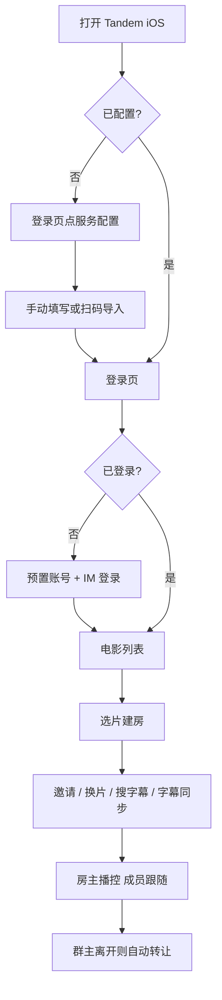

# Tandem 产品需求文档（PRD）

> 版本：v1.4  
> 日期：2026-07-27  
> 状态：草案（待评审）  
> 产品定位：异地好友同步观影 + 实时聊天  
> 客户端：**仅 iOS 原生 App（Swift / SwiftUI 或 UIKit）**  
> 交互形态：**单页应用（SPA）**；「我的」入口在页面**右上角**

---

## 1. 产品概述

### 1.1 背景与问题

异地好友想一起看电影时，常见痛点：

- 各自打开本地/网盘资源，进度容易不同步
- 依赖微信语音/文字，观影与聊天割裂
- 缺少「谁在看、邀请谁、房间内即时吐槽」的轻量闭环
- 外挂字幕与片源分离，切换麻烦

### 1.2 产品目标

**Tandem** 是一款 **iOS 原生 App**，让两人（或多人也预留扩展）在同一部影片的播放房间内：

1. 首次配置七牛云与腾讯云 IM（可扫码导入），再用预置账号登录，维护昵称/头像
2. 从云端片库选择影片进入播放（支持 **mp4 / mkv**）
3. 在播放页看到同房成员、发起邀请、边看边聊；**可在播放页切换当前影片**（房主切换，全员跟随）
4. **播放进度与播放/暂停状态同步**（跟房观影）；**群主离开后自动转让**
5. **字幕**：内嵌 / 七牛外挂 / **在线搜索**；支持 **字幕时间轴同步（延迟校准）**

### 1.3 成功指标（MVP）

| 指标 | 定义 | 目标（MVP） |
|------|------|-------------|
| 登录成功率 | 输入正确凭证后进入片库 | ≥ 95% |
| 邀请到达率 | 邀请发出后被邀方能进入同一房间 | ≥ 90% |
| 聊天可达性 | 房间内消息双方可见延迟 | P95 < 1s |
| 进度同步偏差 | 跟房方与房主进度差（稳态播放） | P95 < 1.5s |
| 片库可用性 | 七牛文件可列出且元数据可展示 | ≥ 90% 影片有封面+标题 |
| 字幕可用性 | 有字幕资源的影片可成功展示至少一路字幕 | ≥ 95% |
| 在线搜字幕成功率 | 有匹配结果时用户能成功加载并显示 | ≥ 85% |
| 扫码配置成功率 | 合法二维码一次导入后可正常登录/列片库 | ≥ 95% |
| 房主转让成功率 | 群主离开且仍有成员时，新房主接管播控 | ≥ 98% |

### 1.4 平台与形态

| 项 | 决策 |
|------|------|
| 客户端 | **仅 iOS 原生 App** |
| 交互形态 | **单页应用（SPA）**：主壳为片库；播放/我的/配置以页内路由或浮层呈现；**无底部 Tab** |
| 「我的」入口 | 主页面导航栏 **右上角**（头像或「我的」按钮） |
| Web / Android | 本期不做 |
| 账号 | **不提供注册**；账号由运营/管理端预置 |
| 片源封装 | 主要 **mp4、mkv** |
| 元数据 | **豆瓣优先**，失败再回退 IMDB，再降级文件名 |
| 云服务 | **七牛云、腾讯云 IM 均可在 App 内配置**；支持二维码导出/扫码导入 |
| 房主离开 | **自动转让**给下一位在房成员（非散房） |

### 1.5 非目标（本期不做）

- 用户自助注册、密码重置、手机号、OAuth
- Web / Android / 跨端客户端
- 弹幕、表情包商店、付费片库
- 清晰度多码率切换、HLS/m3u8 为主流方案
- 版权合规的公开流媒体分发（片源为用户自有资源上传至七牛）
- 多套云配置切换账号（MVP 单套有效配置；可覆盖更新）

---

## 2. 角色与场景

### 2.1 角色

| 角色 | 说明 |
|------|------|
| 房主 / 群主（Host） | 进入影片并创建观影房间的人；可邀请好友；**掌握播放进度权威源**；离开时**自动转让** |
| 观影成员（Member） | 通过邀请进入同一房间；**默认跟随房主进度**；可搜字幕、调字幕同步 |
| 访客（未登录） | 仅能看到登录页与**服务配置入口**；未完成配置前不可登录 |

### 2.2 核心场景

**场景 A：两人同步约看一部片**

1. A 用预置账号登录 → 片库选片 → 进入播放页（自动建房，A 为房主）  
2. A 点「邀请」→ 通过系统分享 / IM 会话把邀请发给 B  
3. B 登录后进入同一房间 → 成员列表、聊天可见  
4. A 播放/暂停/拖进度 → B **自动跟随**；双方边看边聊，可各自开关字幕  

**场景 B：改昵称/头像再约看**

1. 用户点主页**右上角「我的」** → 修改昵称、更换头像 → 保存  
2. 房间成员列表与聊天气泡展示新资料  

**场景 C：中途加入 / 群主离开转让**

1. B 晚于 A 进入：拉取房主当前进度并对齐；看到成员与最近聊天  
2. 普通成员离开：成员列表更新，播控不变  
3. **群主离开且仍有成员**：自动将房主转让给下一位成员 → 系统消息「房主已转让给 xxx」→ 新房主接管播控与心跳  
4. 最后一人离开：房间结束  

**场景 D：字幕（含在线搜索与时间轴同步）**

1. 进入播放页 → 点字幕 → 可选内嵌 / 七牛外挂 / **在线搜索**  
2. 在线搜索：按片名/年份检索 → 选一条下载并加载  
3. 若字幕快/慢半拍：打开 **字幕同步**，用 ± 延迟校准（仅本机）  
4. 字幕轨选择与延迟校准 **仅本机生效**，不影响对方语言偏好  

**场景 E：首次配置云服务 / 扫码给好友**

1. 打开 App → 登录页点「服务配置」→ 填写七牛 + IM，或 **扫码导入**  
2. 保存后返回登录；可用预置账号登录  
3. 已配置用户进入配置页 → **导出二维码** → 好友扫码一键写入同一套环境  

**场景 F：播放中换片**

1. 房主在播放页点「切换影片」/ 片名旁入口 → 从片库列表选另一部  
2. 确认后本房换到新片，进度归零；成员自动加载同一部并跟随  
3. 聊天与房间保留；系统消息提示「房主切换了影片：xxx」  
4. 成员侧不可主动换片（点入口提示「仅房主可切换影片」）  

---

## 3. 信息架构与页面结构

采用 **单页应用（SPA）** 结构：已登录后常驻一个主壳页面（片库），其它功能以 **同壳内路由切换 / 全屏覆盖 / Sheet** 打开，**不使用底部 Tab Bar**。

```
未登录（可视为 SPA 外前置页，或同壳未认证态）
├── 登录页（无注册；含「服务配置」入口）
└── 服务配置（从登录进入；Sheet / 推入）

已登录 · 单页主壳
└── 电影列表（唯一主页面）
    ├── 导航栏左侧：产品名 / 刷新（可选）
    ├── 导航栏右侧：「我的」入口（头像或图标）★
    ├── 点击影片 → 播放页（全屏覆盖主壳，返回后回到列表态）
    └── 点击右上角 →「我的」面板/页
         ├── 个人信息（昵称、头像）
         ├── 服务配置
         └── 退出登录
```

### 3.1 主壳线框（片库 SPA）

```
┌─────────────────────────────────┐
│ Tandem              [我的/头像] │  ← 右上角入口
├─────────────────────────────────┤
│                                 │
│         电影卡片列表             │
│                                 │
└─────────────────────────────────┘
```

### 3.2 全局导航规则

- **无 Tab Bar**；主路径始终落在片库单页  
- **右上角「我的」**：点击后以 Sheet（半屏/全屏）或推入子页展示个人中心；关闭后仍在片库  
- **播放页**：覆盖式进入（隐藏主壳导航）；返回手势/按钮回到片库，右上角「我的」在播放页**默认不展示**（避免误触；个人设置回片库再进）  
- **登录页**：主流程登录 +「服务配置」；登录成功进入 SPA 主壳  
- Deep Link：`tandem://watch?...`、配置码等进入后落到对应 SPA 路由态  
- 遵循 iOS 安全区、横竖屏（播放页优先横屏全屏）

### 3.3 路由态（产品级）

| 路由态 | 说明 |
|--------|------|
| `/login` | 未登录 |
| `/config` | 服务配置（可从登录或「我的」进入） |
| `/` 或 `/movies` | 片库主壳（默认） |
| `/me` | 我的（由右上角打开） |
| `/watch/:roomId` | 播放页覆盖态（可在页内打开「切换影片」选片层） |
---

## 4. 功能详述与交互说明

### 4.1 登录（无注册）

#### 4.1.1 目标

在完成服务配置后，使用**预置账号**完成业务鉴权 + 腾讯云 IM 登录，进入片库。

#### 4.1.2 界面元素

| 元素 | 说明 |
|------|------|
| Logo / 产品名 | Tandem |
| 用户名输入框 | 对应 IM `userID`；必填 |
| 密码输入框 | 必填；可显隐切换 |
| 登录按钮 | 主按钮；**未完成必要配置时置灰或点击提示先配置** |
| 服务配置入口 | **次要按钮/文字链「服务配置」**（登录页必有） |
| 配置状态提示 | 未配置时显示「请先完成服务配置」；已配置可显示脱敏摘要（如 IM AppID 末四位） |
| 错误提示 | 表单下方或 Toast |
| 注册入口 | **不提供** |

> 账号开通：由运营预置用户名与密码，并同步创建 IM 账号。App 内不出现「注册」「忘记密码」。

#### 4.1.3 交互流程

```
打开 App
  → 无有效配置：登录页展示配置引导；点「服务配置」或允许直接进配置页
  → 有配置且有登录态：自动进片库
  → 有配置无登录态：展示登录表单

点「服务配置」
  → 进入服务配置页（见 4.5）

点「登录」（已配置）
  → Loading
  → 使用当前配置中的 IM / 业务参数完成登录（UserSig）
  → IM login 成功 → 电影列表
  → 失败：提示原因

未配置时点「登录」
  → Toast / Alert「请先完成服务配置」→ 可一键跳转配置页
```

#### 4.1.4 状态与异常

| 状态 | 表现 |
|------|------|
| 未配置 | 登录受限；突出配置入口 |
| 配置不完整 | 标明缺失项（如缺七牛 Bucket） |
| 账号/密码错误 | 「用户名或密码错误」 |
| 账号未开通 | 「账号不存在或未开通，请联系管理员」 |
| IM 初始化失败 | 「IM 配置无效，请检查 SDKAppID 等」 |
| 网络失败 | 「网络异常，请重试」 |
| UserSig 过期 | 静默刷新或退回登录页 |
| IM 被踢下线 | Toast「账号在其他设备登录」→ 登录页 |

#### 4.1.5 验收标准

- [ ] 登录页可见「服务配置」入口并可达配置页  
- [ ] 未配置无法成功登录，且有明确引导  
- [ ] 预置正确凭证 + 有效配置可进入片库  
- [ ] App 内无注册入口  
- [ ] 杀进程再开，配置与登录态在有效期内保持  

---

### 4.2 个人信息设置

#### 4.2.1 目标

设置并同步 IM 用户资料：昵称、头像；在成员列表与聊天中展示。

#### 4.2.2 入口与界面

**入口（SPA）：** 片库主壳导航栏 **右上角** — 展示当前用户头像（无头像则用人形图标 /「我的」文案）；点击打开「我的」。

| 元素 | 说明 |
|------|------|
| 右上角入口 | 主壳常驻；点击打开 Sheet 或子页 |
| 头像 | 圆形；点击唤起相册 / 相机 |
| 昵称输入框 | 1–16 字；展示字数 |
| 用户名（只读） | IM userID，不可改 |
| 保存按钮 | 有变更时可点 |
| 服务配置 | 进入配置页（与登录侧同一套） |
| 退出登录 | 次要/危险操作 |
| 关闭 | Sheet 下滑关闭 / 左上角关闭，回到片库 |

#### 4.2.3 交互流程

```
片库主壳 → 点右上角「我的/头像」
  → 打开「我的」
  → 拉取 IM 用户资料并展示

修改昵称 / 更换头像 → 保存 → IM 更新资料

点「服务配置」→ 配置页（可改配；改 IM 关键信息后需重新登录的，弹确认）

点「退出登录」→ 二次确认 → IM logout → 登录页（**保留本地云配置**）
关闭「我的」→ 回到片库列表滚动位置尽量保留
```

#### 4.2.4 校验规则

| 字段 | 规则 |
|------|------|
| 昵称 | 非空；去首尾空格；禁止纯空白 |
| 头像 | jpg/png/heic；压缩后建议 ≤ 1MB；失败保留旧头像 |

#### 4.2.5 验收标准

- [ ] 片库右上角可见「我的」入口并可打开个人中心  
- [ ] 无底部 Tab；「我的」仅通过右上角进入  
- [ ] 保存后重进「我的」显示新资料；右上角头像同步更新  
- [ ] 同房成员与聊天气泡使用新昵称/头像  
- [ ] 退出登录后配置仍在，可直接再登录  

---

### 4.3 电影列表

#### 4.3.1 目标

按当前七牛配置，展示片库中的 **mp4 / mkv** 影片卡片；点击进入播放页。

#### 4.3.2 数据来源

1. 使用配置中的七牛 S3 兼容凭证 **List** Bucket  
2. **仅纳入** `.mp4`、`.mkv`  
3. 元数据：**豆瓣优先 → IMDB → 文件名**  
4. 匹配失败则降级展示  

#### 4.3.3 卡片信息

| 字段 | 必填 | 说明 |
|------|------|------|
| 封面 | 否（有占位） | 海报；无则默认封面 |
| 名称 | 是 | 元数据标题；无则文件名去扩展名 |
| 出版/上映日期 | 否 | 无则「未知」 |
| 简介 | 否 | 卡片截断 2–3 行 |
| 格式角标（可选） | 否 | `MP4` / `MKV` |

#### 4.3.4 界面布局（iPhone · SPA 主壳）

```
┌─────────────────────────────────┐
│ Tandem              [头像/我的] │
├─────────────────────────────────┤
│  （下拉刷新）                    │
│  [海报卡] [海报卡]               │
│  [海报卡] [海报卡]               │
└─────────────────────────────────┘
```

- 双列网格或单列大卡；顶栏右上角固定「我的」  
- 空态 / 骨架 / 错误重试；错误时可提供「去配置」跳转  

#### 4.3.5 交互流程

```
进入片库 → 用当前七牛配置拉列表 → 渲染
点击卡片 → 建房（自己为房主）→ 播放页
七牛鉴权失败 → 错误态「片库配置无效」+ 前往配置
```

#### 4.3.6–4.3.7 状态与验收

同前：仅 mp4/mkv；豆瓣优先；无元数据仍可播。

### 4.4 播放页（核心）

#### 4.4.1 目标

播放所选影片；**页内切换当前影片**；**进度与播控同步**；**字幕（含在线搜索与时间轴同步）**；同房成员；邀请；房间聊天；**群主离开自动转让**。

#### 4.4.2 布局结构（iOS 竖屏默认）

```
┌─────────────────────────────────┐
│ ← 返回  影片名 ▾        [邀请]  │  ← 片名可点，打开切换影片
├─────────────────────────────────┤
│                                 │
│         播放器 + 字幕叠加         │
│  [播/停][进度][字幕][字幕同步][全屏] │
│                                 │
├─────────────────────────────────┤
│ 观看成员（头像横滑）  同步:跟随中  │
├─────────────────────────────────┤
│ 聊天消息列表                     │
├─────────────────────────────────┤
│ [输入框…………]            [发送]  │
└─────────────────────────────────┘
```

也可在导航栏提供独立按钮「换片」。横屏全屏时换片入口放在控件条或「更多」菜单中。

#### 4.4.3 模块 A：播放器

| 能力 | MVP |
|------|-----|
| 播放 / 暂停 | ✅ |
| 进度条拖动（Seek） | ✅ |
| 系统音量 / 静音 | ✅ |
| 全屏（横屏） | ✅ |
| **页内切换影片** | ✅ 见 4.4.3a |
| **进度与播控同步** | ✅ 见 4.4.4 |
| **字幕** | ✅ 见 4.4.5 |
| 清晰度切换 | ❌ |
| 画中画 | ❌（可选后续） |

**片源：**

- 主要封装：**mp4、mkv**  
- 播放器选型需能覆盖常见 mp4（H.264/AAC）及 mkv（可能含 H.264/H.265、多音轨）；若系统 `AVPlayer` 对部分 mkv 不支持，可采用 **VLCKit / 其它跨封装播放引擎**（技术设计阶段敲定）  
- 播放地址：用**当前七牛配置**生成的临时 URL  

**交互：**

```
进入播放页
  → 拉取 playUrl + 字幕资源列表
  → 初始化播放器；房主自动/手动起播；成员进入后先对齐进度再播

播放失败
  → 「无法播放，请稍后重试」+ 重试
  → mkv 解码失败：提示「当前设备暂不支持该封装/编码」
```

#### 4.4.3a 模块 A2：切换当前播放影片（MVP）

**权限：** 仅**当前房主**可发起换片；成员跟随。房间 `roomId` / IM 群**不重建**，聊天记录保留。

**入口：**

| 入口 | 说明 |
|------|------|
| 导航栏影片名（带 ▾） | 主入口；房主可点 |
| 「切换影片」按钮（可选） | 与片名二选一或并存 |
| 成员点击片名 | Toast「仅房主可切换影片」 |

**交互流程：**

```
房主点「切换影片」/ 片名
  → 弹出片库选片层（Sheet / 全屏列表，复用片库卡片数据）
  → 支持搜索/滚动；当前正在播放的影片可标注「播放中」
  → 点选另一部影片
      → 二次确认（可选）：「切换后将从开头播放，全员同步换片」
      → 确认后：
          · 本机加载新片 playUrl，进度归 0，暂停或自动播（建议暂停，由房主点播）
          · 广播 movie_change 信令：{ movieId, title, positionMs:0, paused:true, seq }
          · 导航栏片名更新
          · 本机字幕状态重置（按新片默认规则重选）；旧片字幕偏移不带到新片
          · 系统消息：「房主将影片切换为《xxx》」

成员收到 movie_change
  → Loading「房主切换了影片…」
  → 加载同一 movieId；对齐 position/paused
  → 失败：错误态 + 重试；仍停在旧片并提示「换片失败」

选中与当前相同的影片
  → 不换片，关闭选片层（或 Toast「已在播放」）
```

**产品规则：**

- 换片不散房、不踢人、不丢聊天  
- 换片后进度同步以新片为准；旧片进度不恢复（除非后续做「继续观看」）  
- 选片层数据源与主壳片库一致（当前七牛配置下的 mp4/mkv）  
- 邀请链接仍指向同一 `roomId`；中途加入者拉到**当前** `movieId`  

**验收标准：**

- [ ] 房主可在播放页换片，无需返回主壳重新建房  
- [ ] 成员自动跟随到新片，房间与聊天保留  
- [ ] 成员无法换片，有明确提示  
- [ ] 换片后导航栏片名、播放器内容、同步状态一致  

#### 4.4.4 模块 B：播放进度同步（MVP）

**同步模型：房主权威（Host Authority）**

| 角色 | 权限 |
|------|------|
| 房主 | 可播放、暂停、Seek；状态通过 IM **自定义信令**广播 |
| 成员 | 默认 **跟随模式**：本地播控被房主状态覆盖；Seek/播停以房主为准 |
| 成员（可选增强） | 提供「暂时取消跟随」开关；取消后仅自己自由看，再开跟随则重新对齐——**MVP 建议：默认强制跟随，不做取消**，降低复杂度 |

**同步内容（信令 payload 建议）：**

| 字段 | 说明 |
|------|------|
| `action` | `play` / `pause` / `seek` / `heartbeat` / `movie_change` |
| `positionMs` | 当前播放位置（毫秒） |
| `serverTs` 或 `clientTs` | 时间戳，用于估算网络延迟 |
| `playbackRate` | 固定 1.0（MVP 不开放倍速） |
| `seq` | 单调序号，防乱序覆盖 |

**交互流程：**

```
房主点播放 / 暂停
  → 本地立即生效
  → 发送信令 → 成员收到后执行相同 action，并按 positionMs 对齐

房主拖动进度条松手（Seek）
  → 本地 Seek
  → 发送 seek 信令 → 成员 Seek 到同位置；若原在播放则继续播

成员进入房间（中途加入）
  → 请求房主当前状态（或等下一次 heartbeat）
  → Seek 到 positionMs，并套用 play/pause
  → 短暂「正在同步…」提示（可选）

Heartbeat（建议每 5–10s，仅房主在播放时）
  → 广播当前 positionMs
  → 成员若偏差 > 阈值（如 1.2s）则平滑校正（小幅 Seek 或加速追赶，避免频繁跳动）

网络抖动 / 乱序
  → 仅应用 seq 更大的信令；过期丢弃
```

**UI 提示：**

- 成员侧状态文案：「跟随房主中」  
- 校正时可用轻量 Toast：「已同步进度」.（节流，避免刷屏）  
- 房主侧：「你是房主，进度由你控制」  

**验收标准：**

- [ ] 房主暂停 → 成员 1s 内暂停（弱网可放宽）  
- [ ] 房主 Seek → 成员对齐到目标位置（稳态偏差见成功指标）  
- [ ] 中途加入可对齐到房主当前进度  
- [ ] 乱序信令不会把进度打回旧位置  

#### 4.4.5 模块 C：视频字幕（MVP）

**字幕来源（优先级）：**

1. **内嵌字幕轨**（mkv/mp4 内）  
2. **七牛外挂字幕**（同目录约定命名）— 至少 **SRT、VTT**（ASS 按能力）  
3. **在线搜索字幕** — 按片名/年份检索，用户点选后下载加载  

**字幕面板交互：**

```
点「字幕」/ CC
  → 半屏面板，分区：
      【当前】关闭 / 已选轨名称
      【内嵌】轨列表
      【片库外挂】七牛旁路字幕
      【在线搜索】入口
      【字幕同步】时间轴校准入口

点「在线搜索」
  → 搜索页：默认填入当前片名 + 年份（可改）
  → 搜索 → 结果列表（语言、来源等）
  → 点选 → 下载解析 → 设为当前字幕
  → 无结果/失败：空态或重试

点「字幕同步」
  → 展示当前偏移（如 +0.0s / -1.5s）
  → 「延迟」「提前」步进（0.1s / 0.5s）+ 可选滑条；「重置」归零
  → 实时作用于当前字幕；偏移仅本机，可按 movieId 记忆
```

**产品规则：**

- 字幕轨与 **时间轴偏移均仅本机**，不影响对方  
- 默认有简体中文则开中文；否则关闭  
- 在线字幕可缓存沙盒；API Key 可放服务配置扩展项  

**验收标准：**

- [ ] 内嵌 / 外挂 / 在线搜索均可加载显示  
- [ ] 可关闭字幕；字幕同步可提前/延迟/重置  
- [ ] 不影响对方，不打断播放进度同步  

#### 4.4.6 模块 D：观看成员

横向头像 + 昵称；「我」/「房主」；「N 人在看」。监听成员变更与 **host 变更**。

#### 4.4.7 模块 E：邀请

系统分享 / 复制链接 / 可选 IM 邀请。被邀方登录后 join 并对齐进度。

#### 4.4.8 模块 F：聊天

IM 群文本；系统消息含加入/离开/**房主转让**。

#### 4.4.9 离开与房间生命周期（群主自动转让）

| 事件 | 行为 |
|------|------|
| 普通成员离开 | leave；房主不变 |
| **群主离开且仍有成员** | **自动转让房主** |
| 群主为最后一人离开 | 房间 `ended` |
| App 进后台 | 降频心跳；回前台对齐；进程被杀视作离开并可能触发转让 |
| 同片各自点卡片 | 各自建房，邀请同房 |

**自动转让规则（MVP 定稿）：**

```
群主返回/退群/断线超时（建议 30–60s）
  → 按加入顺序选取下一位在房成员为新房主
  → 广播 host_transfer（newHostUserId、positionMs、play/pause、seq）
  → 更新「房主」角标；系统消息「房主已转让给 {昵称}」
  → 新房主发 heartbeat/播控/换片；忽略旧房主信令
  → 成员继续跟随新房主（不断开同步）
```

转让后新房主同时获得**切换影片**权限。
以群资料 `hostUserId` + 最新 `host_transfer.seq` 为准。

#### 4.4.10 播放页验收标准

- [ ] 进度同步、**页内换片**、字幕（搜索+时间轴）、成员、邀请、聊天可用  
- [ ] 群主离开自动转让，新房主可播控与换片  
- [ ] 最后一人离开房间结束  

---

### 4.5 服务配置页（七牛云 + 腾讯云 IM）

#### 4.5.1 目标

在 App 内配置或扫码导入七牛与腾讯云 IM；支持导出二维码供他人扫码自动配置。

#### 4.5.2 入口

| 入口 | 说明 |
|------|------|
| **登录页「服务配置」** | 必有；未登录可配 |
| **右上角「我的」→ 服务配置** | 已登录可改配/导出 |
| App 内扫码 | 识别配置码后确认导入 |

#### 4.5.3 配置项

**腾讯云 IM：** SDKAppID（必填）、SecretKey（签发 UserSig，敏感，Keychain）、UserSig 有效期（可选）。

**七牛云（S3 兼容）：** AccessKey、SecretKey、Bucket、Endpoint/Region（必填）；自定义域名、对象 Prefix（可选）。

**扩展可选：** 在线字幕 API Key。

> MVP 允许配置中携带 IM SecretKey 以便无独立 BFF 跑通；界面需提示「勿分享到公开场合」。若后续有 BFF，可改为只配 Base URL。

#### 4.5.4 界面布局

```
┌─────────────────────────────────┐
│ ← 返回           服务配置        │
├─────────────────────────────────┤
│ [扫码导入]          [导出二维码]  │
├─────────────────────────────────┤
│ 腾讯云 IM（SDKAppID / SecretKey）│
├─────────────────────────────────┤
│ 七牛云（AK/SK/Bucket/Endpoint）  │
├─────────────────────────────────┤
│ [测试连接]              [保存]   │
└─────────────────────────────────┘
```

敏感字段默认掩码，可显隐。

#### 4.5.5 交互流程

**手动配置：** 填写 →「测试连接」（IM 探测 + 七牛 List）→「保存」写入 Keychain。若已登录且 IM AppID 变更 → 提示需重新登录。

**导出二维码：** 将配置序列化为约定 JSON → 全屏二维码 → 可存相册/分享；强提示含密钥风险。

**扫码导入：** 扫码 → 脱敏预览确认 → 写入 →「配置成功」。非法码不写入、不覆盖。

#### 4.5.6 配置载荷（产品级）

```json
{
  "v": 1,
  "type": "tandem-config",
  "im": { "sdkAppId": 123456789, "secretKey": "..." },
  "qiniu": {
    "accessKey": "...",
    "secretKey": "...",
    "bucket": "movies",
    "endpoint": "s3-cn-east-1.qiniucs.com",
    "domain": "optional.cdn.example.com",
    "prefix": "films/"
  }
}
```

码内容过长时技术侧可改为短链托管；MVP 优先单码 JSON。

#### 4.5.7 验收标准

- [ ] 登录页可进配置页  
- [ ] 保存后可登录、可列片库  
- [ ] 测试连接区分 IM/七牛失败  
- [ ] 导出码 ↔ 另一设备扫码导入一致可用  
- [ ] 退出登录保留配置；非法码不污染现有配置  

---

## 5. 端到端用户旅程

### 5.1 主路径（Happy Path）



### 5.2 资料与配置路径

```
登录页 → 服务配置 → 保存/扫码
片库主壳 → 右上角「我的」 → 改昵称头像 / 服务配置导出二维码
```

---

## 6. 技术架构（产品约束）

### 6.1 组件关系

```
┌─────────────────────────────────────────────┐
│              Tandem iOS App                  │
│  服务配置(Keychain) → 驱动下列连接            │
└───────┬──────────────────────────┬──────────┘
        │ IM SDK + 本地 UserSig     │ S3 API
        ▼                          ▼
┌──────────────┐            ┌──────────────┐
│ 腾讯云 IM     │            │ 七牛 Kodo     │
│ 登录/群/信令  │            │ 片库+外挂字幕 │
└──────────────┘            └──────┬───────┘
                                   │
        ┌──────────────────────────┼──────────────┐
        ▼                          ▼              ▼
┌──────────────┐            ┌────────────┐ ┌────────────┐
│ 豆瓣优先元数据 │            │ 在线字幕源  │ │ 配置二维码  │
└──────────────┘            └────────────┘ └────────────┘
```

> MVP 默认 **客户端直连** 七牛与 IM（配置页写入密钥）。可选后续增加 BFF，配置改为 Base URL。

### 6.2 职责划分

| 能力 | 归属 |
|------|------|
| 云服务配置存储 / 扫码导入导出 | iOS App（Keychain） |
| UserSig 签发 | App 用配置中的 IM SecretKey 本地签发（或可选 BFF） |
| IM 登录、资料、群、聊天、播控/转让信令 | 腾讯云 IM iOS SDK |
| 对象列表、播放/外挂字幕临时 URL | App ↔ 七牛 S3（用配置凭证） |
| 豆瓣优先元数据 | App 或轻量缓存服务 |
| 在线搜字幕 | App ↔ 字幕提供方 API |
| 播放器 + 字幕渲染/时间轴偏移 + 跟房 | iOS App |

### 6.3 腾讯云 IM 能力映射

| 产品功能 | IM 能力 |
|----------|---------|
| 登录 | iOS IM SDK `login` + UserSig |
| 昵称/头像 | 用户资料 |
| 观影房间 | 群组 |
| 观看成员 | 群成员 + 入退群监听 |
| 聊天 | 群文本消息 |
| 邀请 | 自定义消息 + Universal Link |
| 进度同步 | 自定义信令 |
| **页内换片** | 自定义信令 `movie_change` + 更新房间 `movieId` |
| **房主转让** | 自定义信令 `host_transfer` + 群资料更新 `hostUserId` |

### 6.4 片库、格式与元数据约定

**支持扩展名：** `.mp4`、`.mkv`

**命名：** `{Title}.{Year}.{可选}.mp4|mkv`；外挂 `{主名}.{lang}.srt|vtt|ass`

**元数据：** 缓存 → **豆瓣** → IMDB → 文件名降级

**播放/字幕 URL：** 用配置中的七牛密钥生成临时访问（私有桶）。

---

## 7. 数据模型（逻辑）

### 7.1 User / Movie / WatchRoom / ChatMessage

同前；WatchRoom 的 `hostUserId`、`movieId` 均可在房间生命周期内变更（转让 / 换片）。

### 7.2 AppCloudConfig（本地）

| 字段 | 说明 |
|------|------|
| im.sdkAppId / im.secretKey / im.userSigExpire | IM |
| qiniu.accessKey / secretKey / bucket / endpoint / domain / prefix | 七牛 |
| subtitleApiKey | 可选 |
| updatedAt / configVersion | 元信息 |

### 7.3 PlaybackSyncSignal

增加 `movie_change`、`host_transfer`；原 play/pause/seek/heartbeat 及换片后仅**当前房主**可发。`movie_change` 必带新 `movieId`。

### 7.4 SubtitleState（本机）

| 字段 | 说明 |
|------|------|
| movieId | 影片 |
| source | embedded / qiniu / online |
| trackId / url | 当前轨 |
| offsetMs | 字幕同步偏移（可负） |

---

## 8. 关键接口清单（产品级）

MVP 以 **客户端直连** 为主时，业务 HTTP 可极少；若保留轻量服务：

| 接口/能力 | 说明 |
|-----------|------|
| 本地 UserSig | 用配置 SecretKey 生成 |
| 七牛 S3 List/Get/预签名 | 片库与播放、外挂字幕 |
| 豆瓣/IMDB 查询 | 元数据 |
| 在线字幕 Search/Download | 第三方 API |
| （可选）`POST /rooms` 等 | 若引入 BFF 再启用 |

IM 消息/信令走 SDK。

---

## 9. 权限与安全

| 项 | 要求 |
|------|------|
| 无公开注册 | 预置账号 |
| 配置密钥 | 存 Keychain；UI 掩码；导出码含密钥须警告 |
| 扫码导入 | 确认页脱敏预览；防误覆写可「覆盖确认」 |
| 同步信令 | 仅当前 hostUserId 有效 |
| 转让 | 防旧主机抢权；以最新 transfer seq 为准 |
| 内容 | 自有片源；在线字幕遵守来源服务条款 |

---

## 10. 异常与边界汇总

| 场景 | 处理 |
|------|------|
| 未配置 | 登录引导去配置页 |
| 配置错误 | 测试连接失败定位；片库/登录明确报错 |
| 二维码非法/过长 | 提示失败；过长走短链方案（后续） |
| 群主离开 | 自动转让；仅一人则结束房间 |
| 转让竞态 | seq + 群资料 host 为准 |
| 换片失败（成员拉流失败） | 重试；提示仍可看聊天；房主可再切回 |
| 换片过程中房主再 Seek | 以最新 seq 为准；先完成 movie_change 再应用后续播控 |
| 无字幕 / 搜索失败 | 空态与重试 |
| 字幕偏移过大 | 限制合理范围（如 ±30s） |
| mkv 不支持 | 明确提示 |
| 多端登录 | IM 踢下线策略 |

---

## 11. MVP 范围与分期

### MVP（v1.0）— iOS only

- [x] 服务配置页（七牛 + IM）；登录页配置入口  
- [x] **SPA 主壳 + 右上角「我的」**（无底部 Tab）  
- [x] 配置导出二维码 / 扫码自动配置  
- [x] 登录（预置账号，无注册）  
- [x] 个人信息（昵称、头像）  
- [x] 电影列表（mp4/mkv，豆瓣优先）  
- [x] 播放页：播放器、成员、邀请、聊天  
- [x] **播放页切换当前影片**（房主换片，全员跟随，房间保留）  
- [x] 播放进度同步  
- [x] **群主离开自动转让**  
- [x] 字幕：内嵌 + 外挂 + **在线搜索** + **字幕时间轴同步**  

### v1.1

- 成员「暂时取消跟随」  
- 配置短链托管（大码）  
- 多套配置切换  
- 离线推送；字幕样式细调  

### v1.2

- 弹幕、片单/收藏、观影历史、倍速  

---

## 12. 交互细节补充（iOS 体验）

1. **登录页**：无注册；固定「服务配置」入口；未配置时弱提示。  
2. **SPA 主壳**：片库为唯一主页；**右上角「我的」**常驻；无底部 Tab。  
3. **「我的」**：优先 Sheet，避免打断列表心智；保存后右上角头像即时刷新。  
4. **配置页**：测试连接反馈分区；导出前二次风险确认。  
5. **扫码**：仅识别 `type=tandem-config`；确认后写入。  
6. **字幕同步**：步进可长按连发；显示当前偏移。  
7. **转让瞬间**：成员侧短 Toast「房主已变为 xxx」；播控无缝切换。  
8. **聊天与播放**：发消息不改播控；全屏聊天浮层。  
9. **VoiceOver**：右上角「我的」、配置与字幕关键控件有标签。  

---

## 13. 已确认事项

| # | 问题 | 结论 |
|---|------|------|
| 1 | 客户端 | 仅 iOS 原生 |
| 2 | 元数据 | 豆瓣优先 → IMDB |
| 3 | 同片同房 | 邀请制 |
| 4 | 播放进度同步 | MVP，房主权威 |
| 5 | 账号 | 不注册，预置 |
| 6 | 封装 | mp4、mkv |
| 7 | 字幕 | 内嵌+外挂+在线搜索+时间轴同步；本机生效 |
| 8 | 群主离开 | **自动转让** |
| 9 | 云服务 | 七牛+IM **可配置**；配置页；导出/扫码；登录页入口 |
| 10 | 导航形态 | **单页应用（SPA）**；无 Tab；**「我的」在右上角** |
| 11 | 播放页换片 | **支持**；仅房主；全员跟随；不重建房间 |

### 仍待技术评审

| # | 问题 | 建议 |
|---|------|------|
| A | mkv 播放引擎 | AVPlayer vs VLCKit |
| B | 同步/转让通道 | IM 自定义信令 |
| C | 在线字幕提供方 | OpenSubtitles 等 + 可选 API Key 配置 |
| D | UserSig | MVP 本地密钥签发；生产可迁 BFF |
| E | 二维码体积 | 字段压缩；过长则短链 |

---

## 14. 附录：页面线框索引

| 页面 | 关键交互 |
|------|----------|
| 登录 | 配置入口 → 登录 → 进入 SPA 片库主壳 |
| 服务配置 | 填写/测试/保存；扫码导入；导出二维码 |
| 片库（主壳） | 右上角「我的」；浏览选片 → 播放覆盖态 |
| 我的 | 由右上角打开；资料；服务配置；退出（保留配置） |
| 播放 | 换片；播控同步；搜字幕；字幕同步；邀请；聊天；群主离开转让 |

---

**文档维护：** v1.4 增补播放页**切换当前影片**（房主发起、`movie_change` 全员跟随、房间与聊天保留）。下一步可输出 iOS 技术设计与配置/信令协议细则。
